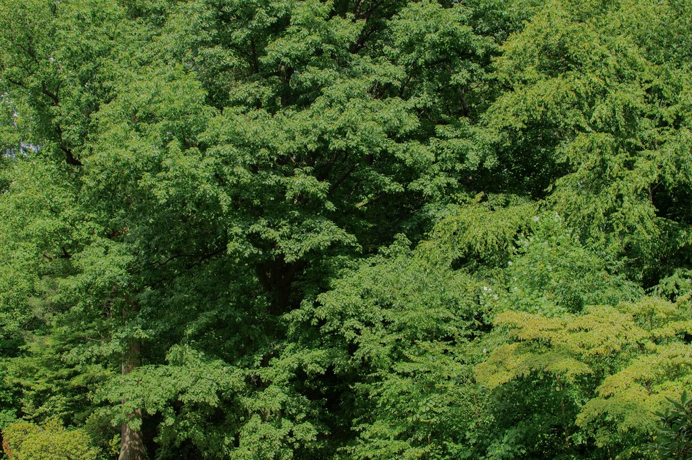

# Andrew "Drew" McDonald

[andrewwilsonmcdonald@gmail.com](mailto:andrewwilsonmcdonald@gmail.com) |
[amcdonald@wfuv.org](mailto:amcdonald@wfuv.org) |
[Signal](https://signal.me/#eu/8z0QYpc5IVoPuMmKzTyAFC6Ycu3BWbNHxj-Q1nc_qL2Q3yuWzR1I-6YuRk0Kp4Ix) |
[LinkedIn](https://linkedin.com/in/andrew-mcdonald-7b720228b) |
[Twitter/X](https://x.com/McNatParks) |
[flickr](https://www.flickr.com/photos/203534756@N02/)

I'm a journalist and student at Fordham University studying Political Science and History. I report for WFUV, Fordham's NPR affiliate, I'm a paid research assistant/archivist for Fordham's Political Science department, and I serve as Executive Vice President of Fordham University's United Student Government.

## Current Work

**WFUV News** — Website Editor and Reporter covering New York City politics, state government, and mayoral races. I've interviewed candidates, including Zohran Mamdani, Brad Lander, and Curtis Sliwa. I produce and host our daily news podcast, and you can catch me on air on the hour on Wednesdays. I revived and reformatted the What's What Weekly newsletter.

**Fordham University Political Science Department** — Research assistant for Professor Boris Heersink, coding and analyzing Moral Majority newsletters from the 1970s-80s for research on the religious right's emergent electoral influence in the late 20th century.

## Writing & Audio

<ul>

  <li>
    <a href="{{ clip.url }}">{{ clip.title }}</a>
     — {{ clip.desc }}
  </li>

</ul>

## Education & Background

I'm graduating from Fordham University in May 2026 and have been accepted into graduate programs in journalism at Oxford Brookes University and media practice at the University of Sydney in fall 2026. I am also a current semi-finalist for a Fulbright English Teaching Award with the U.S. State Department in Ulaanbaatar, Mongolia.

Previously: 2022 graduate from Jesuit High School, Sacramento, press aide internship for fmr. California Assembly Speaker Anthony Rendon, and various roles at Fordham student publications, including *The Ram* and *the paper*.

## Skills

Audio editing (Adobe Audition, ProTools, REAPER), video editing (Final Cut Pro, DaVinci Resolve), statistical software (SPSS, R, Python, JMP/Stata), and 3 years of experience in NPR-affiliate broadcast journalism production.
